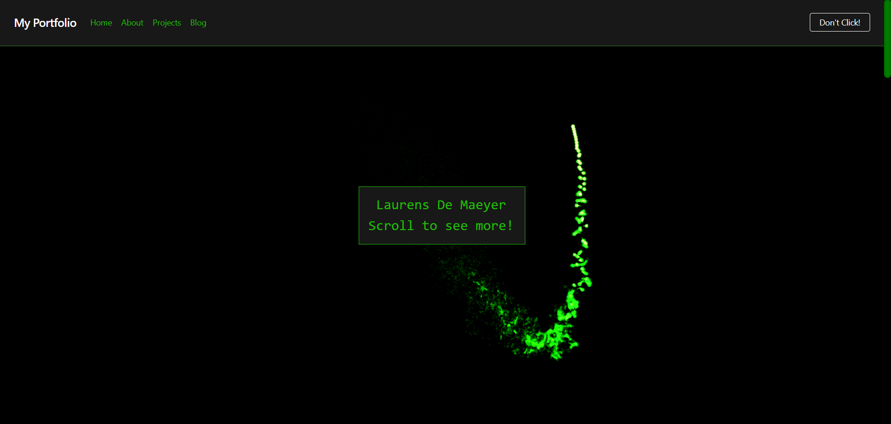
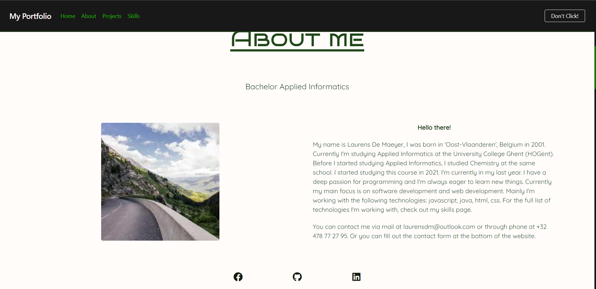
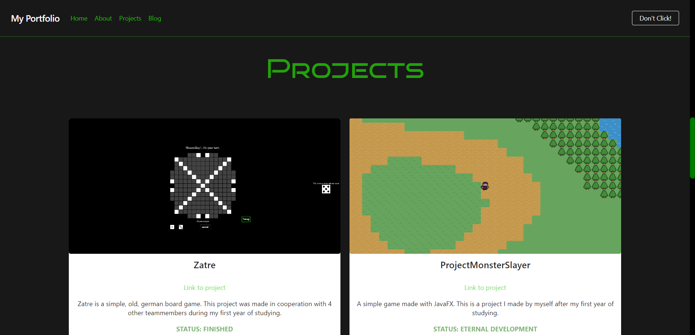

# Portfolio

***WORK IN PROGRESS***

This is my portfolio. 

## Global information

This project uses vue and standard javascript. 

Styling is done with vuetify and tailwindcss.

## Pictures





## Project Setup

```sh
npm install
```

### Compile and Hot-Reload for Development

```sh
npm run dev
```

### Run Unit Tests with [Vitest](https://vitest.dev/)

```sh
npm run test:unit
```

### Run End-to-End Tests with [Cypress](https://www.cypress.io/)

```sh
npm run test:e2e:dev
```

```sh
npm run build
npm run test:e2e
```
